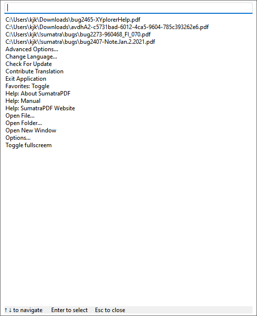

# Command Palette

**Available in version 3.4 or later.**

Use `Ctrl + K` to invoke command palette:

Command palette is fast and convenient way to:

- access all SumatraPDF functionality
- open previously opened files
- switch to another tab

How to use it:

- press `Ctrl-K` to show command palette window
- enter text to narrow down list of matches
- `up` / `down` arrow navigate between matches
- `Enter` to execute selected match (or double-click with mouse)
- `Escape` to close the window (or click outside of it)

The list contains:

- list of currently opened files (tabs)
- list of recently opened files
- [commands](Commands.md)