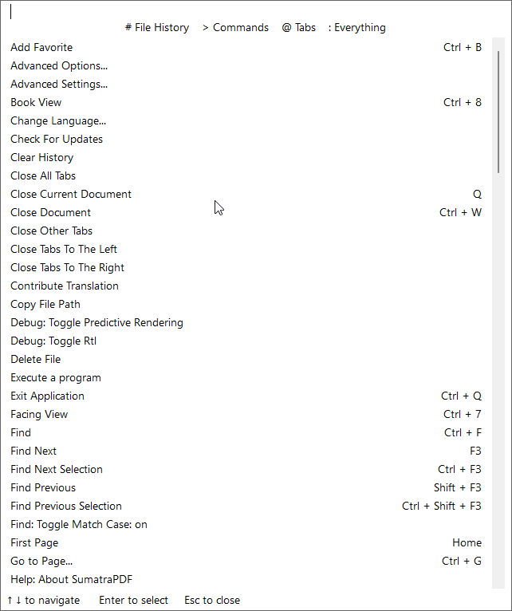
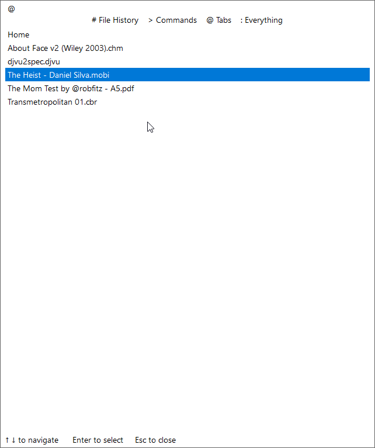
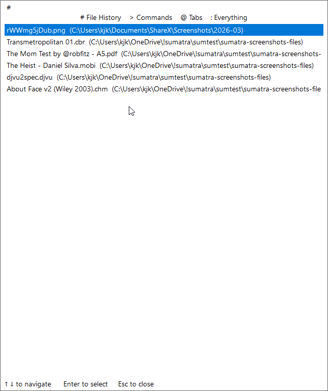
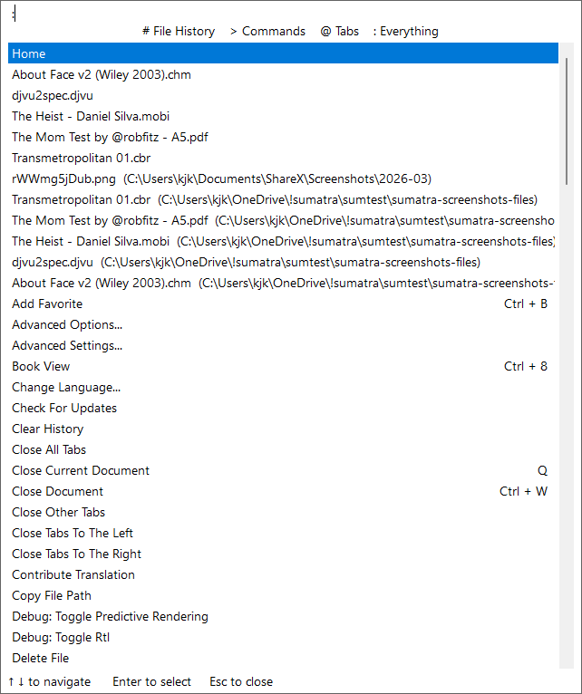

# Command Palette

**Available in version 3.4 or later.**

## Commands

Use `Ctrl + K` to invoke command palette:



Command palette is fast and convenient way to:

- access all SumatraPDF functionality via commands : default view and `>`
- `#` : open previously opened files
- `@` : switch to another tab
- `:` : combined view (replicates behavior before ver 3.6)

How to use it:

- press `Ctrl-K` to show command palette window
- enter text to narrow down list of matches
- `up` / `down` arrow navigate between matches
- `Enter` to execute selected match (or double-click with mouse)
- `Escape` to close the window (or click outside of it)

By default it shows available commands.

## Tabs

Type `@` to switch between opened tabs:



## File History

Type `#` to open a file from history of opened files:



## Combined view

Type `:` for a combined view (replicates 3.4 and 3.5 behavior):



## Replicate 3.4 and 3.5 behavior

In 3.6 we've changed default command palette view from combined (`:`) to just commands (`>`).

You can replicate pre-3.6 behavior by adding to [advanced settings](./Advanced-options-settings.md):

```
Shortcuts [
  [
    Key = Ctrl + K
    Command = CmdCommandPalette :
  ]
]
```

The default for `Ctrl + K` keyboard shortcut is `CmdCommandPalette` [command](./Commands.md).

This changes it to `CmdCommandPalette :`, which replicates 3.4/3.5 behavior.
