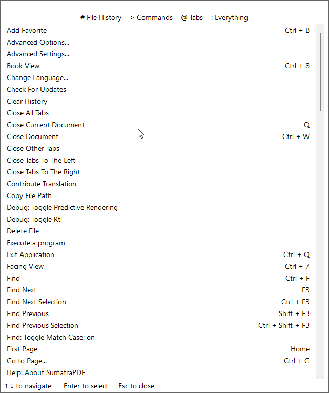
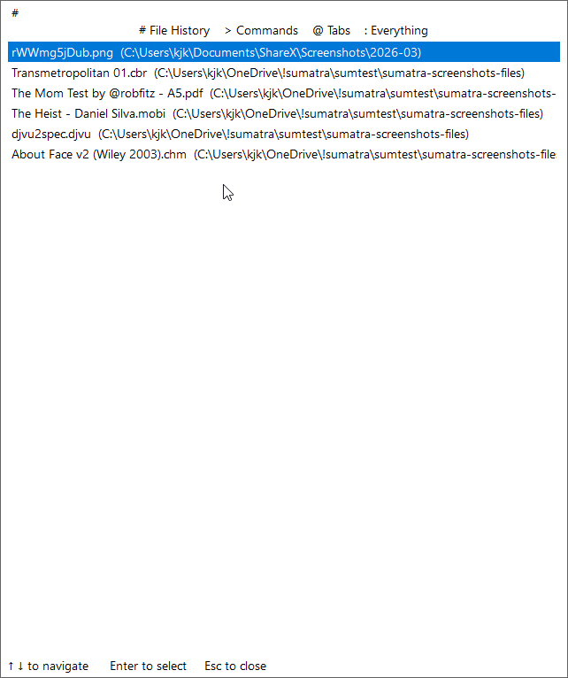

# Command Palette

**Available in version 3.4 or later.**

## Commands

Use `Ctrl + K` to invoke the command palette, or click the command-palette button to the left of the **SumatraPDF** title on the home page:



The command palette is a fast and convenient way to:

- access all SumatraPDF functionality via commands: the default view and `>`
- `#` : open a file from history
- `@` : switch to another tab
- `&` : navigate pages with thumbnails
- `%` : jump to a table of contents entry in the current document
- `$` : jump to a favorite (current document's favorites first, then others)
- `*` : jump to an annotation in the current PDF
- `=` : change a setting
- `:` : combined view (replicates behavior before ver 3.6)

How to use it:

- press `Ctrl + K` to show the command palette window
- enter text to narrow down list of matches
- `Up` / `Down` arrows navigate between matches
- `Page Up` / `Page Down` jump a page of matches
- `Home` / `End` go to the first / last match when the caret is already at the start / end of the query (`Ctrl + Home` / `Ctrl + End` always do)
- `Ctrl + A` selects the query
- `Ctrl + C` copies the selected query text (`Ctrl + V` pastes into the query)
- `Enter` executes the selected match (or double-click it with the mouse)
- `Escape` closes the window (or click outside it)

By default, it shows the available commands.

## Switching between tabs

Type `@` to switch between open tabs:


## File history

Type `#` to open a file from the list of previously opened files:



## Table of contents

Type `%` to jump to a table of contents entry of the current document (or press
`Shift + F12`, which is bound to the `CmdCommandPaletteTOC` command). That
command can also be a [toolbar button](./Customize-toolbar.md#command-palette-on-the-toolbar).

The list shows the fully expanded table of contents, indented to reflect the
tree hierarchy. The entry closest to the current page is pre-selected. Type to
filter, then `Enter` (or double-click) to navigate to the selected entry.

## Page thumbnails

Type `&` to open the thumbnail grid for the current document. The current page
is selected initially. Use the arrow keys, `Home`, `End`, mouse, or the
scrollbar to navigate; `Enter` opens the selected page and `Escape` closes the
grid.

## Favorites

Type `$` to jump to a favorite (bookmark):

Favorites of the current document are listed first, followed by favorites of
other documents (labeled with the file name). Type to filter, then `Enter` (or
double-click) to navigate to the selected favorite. Picking a favorite in
another document opens that document.

You can bind a keyboard shortcut to open the palette directly in favorites mode
with the `CmdCommandPaletteFavorites` [command](./Commands.md) (see
[Managing favorites](./Managing-favorites.md)). The same command can be a
[toolbar button](./Customize-toolbar.md#command-palette-on-the-toolbar).

## Annotations

Type `*` to jump to an annotation in the current PDF. `* Annotations` appears
in the mode row once annotations have been collected and the document has at
least one. Collection runs in the background the first time the command palette
or **Find Annotation** needs them, and the result is reused (including when
there are none).

Rows match the **Find Annotation** list: type, contents, page number. Filter
with the same syntax (`:t=text`, `:a=kjk`, `:c+`, plain words). `Enter` or
double-click selects the annotation and jumps to it.

## Settings

Type `=` to change a setting without opening
[Advanced Options](./Advanced-options-settings.md). Every setting holding a
single value is listed by its dotted name, with its current value on the right;
a value that isn't the default is shown in bold, and those settings are listed
first. Type to filter by name or by value. Settings holding a list, and the
compact ones like `WindowMargin`, are only editable in Advanced Options.

`Enter` on a `true` / `false` setting toggles it. Any other setting asks for a
value: the query becomes `=<name> = <value>`, and

- a setting restricted to a fixed set of values (`Toolbar`, `Scrollbars`,
  `PrintScale`, ...) lists them; type to narrow the list, `Enter` picks one
- any other setting takes what you type, starting from the current value

The change takes effect immediately, exactly as if it had been saved from
Advanced Options - no restart. You can also type the whole thing at once, e.g.
`=ZoomIncrement = 25`; the name can be the last part of a dotted setting
(`Units` for `FixedPageUI.PageGrid.Units`) as long as only one setting ends
with it.

## Combined view

Type `:` for a combined view (replicates 3.4 and 3.5 behavior):


## Replicate 3.4 and 3.5 behavior

In 3.6, we changed the default command palette view from combined (`:`) to commands only (`>`).

You can replicate pre-3.6 behavior by adding to [advanced settings](./Advanced-options-settings.md):

```
Shortcuts [
  [
    Key = Ctrl + K
    Command = CmdCommandPalette :
  ]
]
```

The default command for the `Ctrl + K` keyboard shortcut is [`CmdCommandPalette`](./Commands.md).

This changes it to `CmdCommandPalette :`, which replicates 3.4/3.5 behavior.
