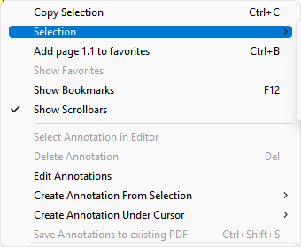
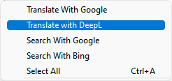
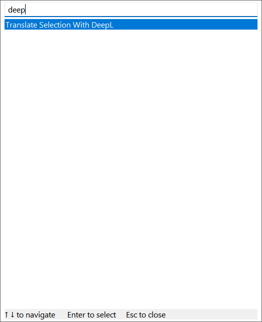

# Customize search / translation services

**Available in version 3.4 or later.**

You can send selected text to Google / Bing search engine or Google / DeepL translation web service:

- select text using mouse
- right-click for context menu



- use `Selection` sub-menu and select web service to use for translation or search:



You can also use command palette (`Ctrl + K`):

- select text
- `Ctrl + K` to open command palette
- type e.g. `deepl` to find `Translate with DeepL` command



- press `Enter` (or double-click with mouse) to execute the action

## Adding more services

You can add more web services using [advanced settings](https://www.sumatrapdfreader.org/settings/settings.html).

To configure an external reader:

- use `Settings / Advanced Settings...` menu to open configuration file
- modify `SelectionHandlers` section

Here's an example of adding [DuckDuckGo](https://duckduckgo.com/) search engine:

```
SelectionHandlers [
  [
    URL = https://duckduckgo.com/?ia=web&q=${selection}
    Name = &DuckDuckGo
  ]
]
```

`URL` is the website that will be launched. `${selection}` will be replaced with (URL-encoded) current selection.

`Name` is what shows in the menu. You can use `&` characters to add Windows hot-key for keyboard-only invocation.