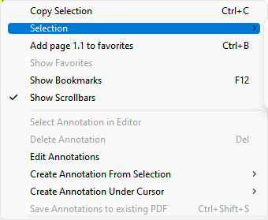
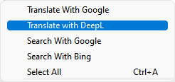
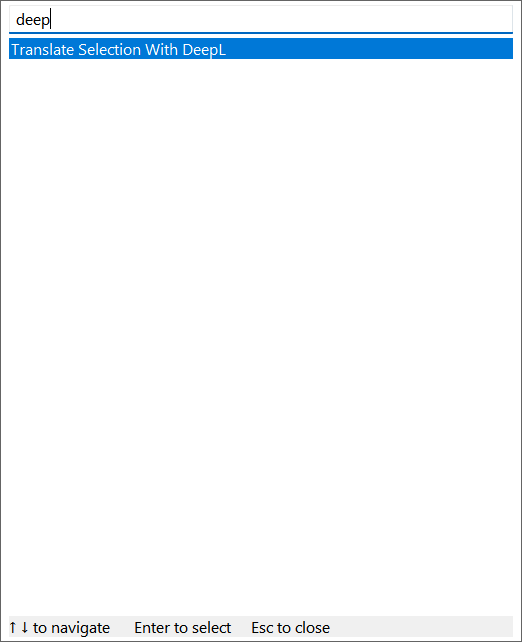

# Customize search / translation services

**Available in version 3.4 or later.**

You can send selected text to the Google or Bing search engine, or to the Google or DeepL translation service:

- select text using the mouse
- right-click to open the context menu



- use the `Selection` submenu and select the web service to use for translation or search:



You can also use the command palette (`Ctrl + K`):

- select text
- press `Ctrl + K` to open the command palette
- type, for example, `deepl` to find the `Translate with DeepL` command



- press `Enter` (or double-click with the mouse) to execute the action

## Adding more services

You can add more web services using [advanced settings](https://www.sumatrapdfreader.org/settings/settings.html).

To configure a selection handler:

- use the `Settings / Advanced Settings...` menu to open the configuration file
- modify the `SelectionHandlers` section

Here is an example that adds the [DuckDuckGo](https://duckduckgo.com/) search engine:

```
SelectionHandlers [
  [
    URL = https://duckduckgo.com/?ia=web&q=${selection}
    Name = &DuckDuckGo
    Key = Ctrl + t
  ]
]
```

`URL` is the website that will be launched. `${selection}` will be replaced with the current selection, URL-encoded as a query value (spaces become `%20`, and reserved characters such as `?`, `"`, `&` and `#` become `%XX` so they are not parsed as more URL syntax).

`Name` is what appears in the menu. You can use an `&` character to add a Windows hotkey for keyboard-only invocation.

**Ver 3.6+:** `Key` is a keyboard shortcut in the same format as in the [`Shortcuts`](Customize-keyboard-shortcuts.md) advanced setting.

## A button on the selection toolbar (ver 3.7+)

Selecting text pops up a small toolbar over the selection (turn it off with
`SelectionToolbar` in advanced settings). `SelectToolbarNameOrSvg` puts the
handler on it, so sending the selection to a service is one click instead of a
trip through the context menu:

```
SelectionHandlers [
  [
    URL = https://duckduckgo.com/?q=${selection}
    Name = &DuckDuckGo
    SelectToolbarNameOrSvg = Search
  ]
]
```


The value is the button's text. Keep it short — the toolbar sits over what you
are reading, and every handler you add makes it wider. Unlike `Name`, it is
shown as you typed it: no `&` hotkey handling, and no translation.

If the value starts with `<svg`, it is an SVG icon and is drawn instead of the
text, in the same format as `ToolbarSvgIcon` in
[Customize toolbar](Customize-toolbar.md#using-svg-icons): 24x24,
`stroke="currentColor"` and `fill="none"` so the icon picks up the theme's text
color, and a full-size `<rect>` so its background comes out transparent. The
icon is rendered at `ToolbarSize`, matching main-toolbar icons, and the
handler's `Name` is its tooltip.
[Tabler Icons](https://tabler.io/icons) are already in that shape:

```
SelectionHandlers [
  [
    URL = https://duckduckgo.com/?q=${selection}
    Name = &DuckDuckGo
    SelectToolbarNameOrSvg = <svg xmlns="http://www.w3.org/2000/svg" width="24" height="24" viewBox="0 0 24 24" stroke-width="2" stroke="currentColor" fill="none" stroke-linecap="round" stroke-linejoin="round"><rect x="0" y="0" width="24" height="24" stroke="none"></rect><circle cx="11" cy="11" r="7"></circle><path d="M21 21l-4.35-4.35"></path></svg>
  ]
]
```

Handlers without `SelectToolbarNameOrSvg` are unaffected: they stay in the
context menu and the command palette as before.

To put the same handler on the **main** toolbar, set `ToolbarText` (a short
label) or `ToolbarSvgIcon` (same SVG format as [Customize toolbar](Customize-toolbar.md#using-svg-icons)).
If both are set, the icon is used:

```
SelectionHandlers [
  [
    URL = https://duckduckgo.com/?q=${selection}
    Name = &DuckDuckGo
    ToolbarText = DDG
  ]
]
```

## Choose which buttons are on the selection toolbar (Ver 3.7+)

`SelectionToolbarLayout` lists the built-in buttons you want, in the order you
want them — the same idea as `ToolbarCustomLayout` for the main toolbar:

```
SelectionToolbarLayout = CmdCopySelection | CmdCreateAnnotHighlight CmdCreateAnnotUnderline
```

- entries are [command ids](Commands.md), separated by spaces (commas and semicolons work too)
- `|` (or `Separator`) inserts a separator
- **leaving a button out is how you hide it**
- an empty value (the default) is the standard set
- names that aren't selection-toolbar buttons are ignored (see the log with `-log`)
- handler buttons from `SelectToolbarNameOrSvg` still come last

This is the standard selection toolbar written out:

```
SelectionToolbarLayout = CmdCopySelection CmdTranslateSelection CmdReadAloudSelection CmdCreateAnnotHighlight CmdCreateAnnotUnderline CmdCreateAnnotSquiggly CmdCreateAnnotStrikeOut CmdCreateAnnotText
```

## Sending long text (ver 3.7+)

A URL can only hold so much text. If you select several paragraphs and send them
to a service with the default settings, the text is shortened to fit and you get
a notification saying so.

`Method` controls how the selection is sent:

| Method             | Length limit | Sees your browser session | Custom headers | Shows result      |
| ------------------ | ------------ | ------------------------- | -------------- | ----------------- |
| `GET` (default)    | ~8000 chars  | yes                       | no             | in a browser tab  |
| `POST`             | none         | no                        | yes            | in a notification |
| `POST-VIA-BROWSER` | none         | yes                       | no             | in a browser tab  |

If `Method` is missing or is `GET`, a handler behaves exactly as it did before
3.7, so existing settings keep working unchanged.

### Why the GET limit exists

With `GET` the selection has to fit in the URL, and URL-encoding makes text
bigger — sometimes much bigger:

- an ASCII letter stays 1 character
- a space becomes `%20`, a newline becomes `%0A` — 3 characters each
- a Chinese, Japanese or Korean character is 3 bytes of UTF-8, so it becomes
  `%XX%XX%XX` — **9 characters**

So the same budget is roughly 8000 Latin characters but only about 900 CJK
characters. When the text doesn't fit, SumatraPDF shortens it at a character
boundary (never in the middle of a character) and tells you it did.

Use `POST` or `POST-VIA-BROWSER` when you need to send more.

### `Method = POST`

SumatraPDF makes the HTTP request itself and puts the selection in the request
body, so there is no length limit. This is the option for API services:

```
SelectionHandlers [
  [
    Name = Send to my API
    URL = https://example.com/api/summarize
    Method = POST
    Headers = Authorization: Bearer my-secret-key
  ]
]
```

- `Body` is the request body. If you leave it out, the body is the raw selection
  and nothing else.
- `ContentType` sets the `Content-Type` header. Default is
  `text/plain; charset=utf-8`, which matches the default raw-selection body.
- `Headers` are extra headers, one per line. A settings value is a single line,
  so separate them by typing `\n`:
  `Headers = Authorization: Bearer key\nX-Client: sumatrapdf`

The request is made by SumatraPDF, **not** by your browser. The service does not
see your cookies or logins — whatever you put in `Headers` is the only
credential it gets. That is usually what you want for an API key, and it means
`POST` will _not_ work with a site that expects you to be signed in; use
`POST-VIA-BROWSER` for those.

The response is not rendered. You get a notification with the HTTP status code
and the beginning of the response body, which is enough to see whether it worked
and what the error was.

### `Method = POST-VIA-BROWSER`

SumatraPDF writes a small temporary HTML page containing a form that submits
itself, and opens it in your default browser. Also unlimited in length, and
because your browser sends it, the service sees your normal session — cookies,
logins and all. That is what you want for a site you're already signed in to.

```
SelectionHandlers [
  [
    Name = Send to my web app
    URL = https://example.com/analyze
    Method = POST-VIA-BROWSER
    Body = text=${selection}&lang=${userlang}
  ]
]
```

`Body` is a form-encoded template: `name=value` pairs separated by `&`. Each
value becomes a hidden form field. If you leave `Body` out, a single field named
`text` is sent.

The template is split into fields **before** substitution, so a selection
containing `&` or `=` can't accidentally create extra fields.

`ContentType` and `Headers` are ignored here — a form submission always posts
`application/x-www-form-urlencoded` and cannot set custom headers. If you need
an `Authorization` header, use `Method = POST`.

Some sites reject a form submitted from a local file (CSRF protection). If that
happens, `POST` with an API key, or `${selectionfile}` with a helper program, is
the way around it.

## Placeholders

These can be used in `URL`, `Exe`, and `Body`:

| Placeholder            | Replaced with                                                       |
| ---------------------- | ------------------------------------------------------------------- |
| `${selection}`         | the selected text. URL-encoded in `URL`, raw in `Body` / `Exe`      |
| `${selectionjson}`     | the selected text escaped for a JSON string (no surrounding quotes) |
| `${selectionfile}`     | path to a temporary UTF-8 file holding the selection                |
| `${selectionPosition}` | the selection's bounding box in screen pixels, `x,y,dx,dy`          |
| `${userlang}`          | language code of the current UI language, e.g. `de` for German      |

`${selectionjson}` matters more than it looks. Selected text routinely contains
quotes and newlines, and dropping those into a JSON body raw produces invalid
JSON that the service rejects. Inside a JSON body always use `${selectionjson}`,
never `${selection}`:

```
Body = {"text": "${selectionjson}", "target": "de"}
```

## Running a program instead of a web service

`${selectionPosition}` is for a helper that wants to sit next to the selection
(a dictionary popup, Anki helper, …). The four integers are the bounding box
of the visible selection in screen pixels, the same space as a Win32
`SetWindowPos`. It is empty if there is no visible selection.

Use `Exe` instead of `URL` to hand the selection to a program. Combined with
`${selectionfile}` there is no length limit at all and no encoding to worry
about, because the text goes through a file rather than the command line:

```
SelectionHandlers [
  [
    Name = Summarize locally
    Exe = "C:\tools\summarize.exe" --pos ${selectionPosition} "${selectionfile}"
  ]
]
```

The temporary file is UTF-8 and lives in your temp directory. It is reused (and
overwritten) the next time a handler runs.

## Examples for real services

These are starting points. Check the service's own documentation for the current
endpoint and parameter names rather than assuming these still match.

### DeepL API

DeepL takes form-encoded parameters and an API key in a header. Free accounts
use `api-free.deepl.com`, paid ones use `api.deepl.com`:

```
SelectionHandlers [
  [
    Name = DeepL to German
    URL = https://api-free.deepl.com/v2/translate
    Method = POST
    ContentType = application/x-www-form-urlencoded
    Body = text=${selection}&target_lang=DE
    Headers = Authorization: DeepL-Auth-Key your-key-here
  ]
]
```

This puts the raw selection into a form-encoded body. If your text can contain
`&` or `=`, prefer DeepL's JSON API with `${selectionjson}` instead.

### A local LLM via Ollama

Ollama runs on your own machine and needs no API key, so nothing leaves your
computer — a good thing to try first:

```
SelectionHandlers [
  [
    Name = Summarize with Ollama
    URL = http://localhost:11434/api/generate
    Method = POST
    ContentType = application/json
    Body = {"model": "llama3", "prompt": "Summarize this:\n\n${selectionjson}", "stream": false}
  ]
]
```

### An OpenAI-compatible chat API

Anything speaking the OpenAI chat-completions protocol (OpenAI itself, or a
local server such as LM Studio) works the same way:

```
SelectionHandlers [
  [
    Name = Explain this
    URL = https://api.openai.com/v1/chat/completions
    Method = POST
    ContentType = application/json
    Body = {"model": "gpt-4o-mini", "messages": [{"role": "user", "content": "Explain:\n\n${selectionjson}"}]}
    Headers = Authorization: Bearer sk-your-key-here
  ]
]
```

The reply arrives as raw JSON in a notification. For reading a long answer, a
helper program using `Exe` and `${selectionfile}` is more comfortable.

## A warning about API keys

Anything in `Headers` is stored **in plain text** in your settings file, which is
not encrypted. Don't put a key there that you would mind someone reading if they
got hold of the file, and remove keys before sharing your settings. Prefer keys
that are scoped and revocable.

`POST` also sends your selected text to whichever server you configured. That is
the point of the feature, but it's worth being deliberate about which documents
you use it on.
