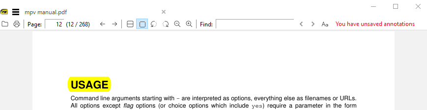
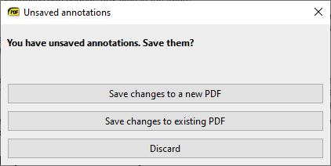
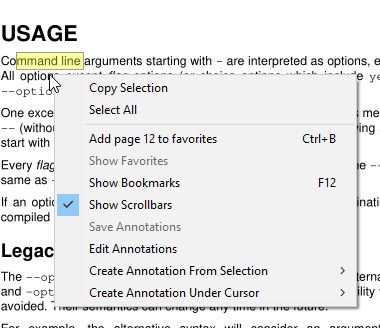
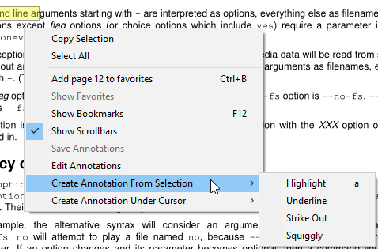
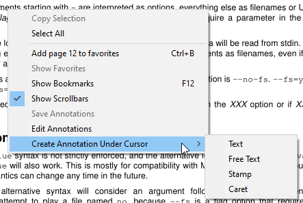
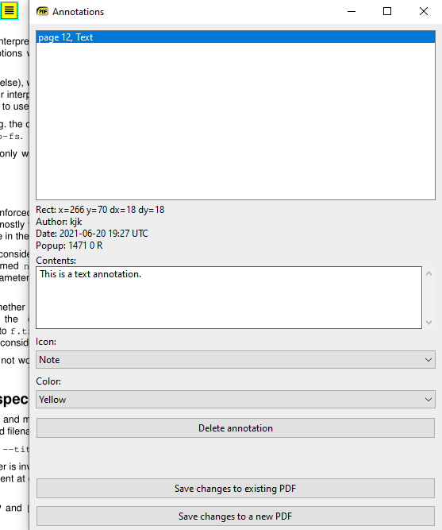
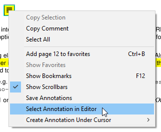

# Editing annotations

**Available in version 3.3 or later.**

You can add / edit annotations in PDF files.

## Highlight text with `a`

Most common annotation is highlighting of text: select text and press `a`. This creates a highlight annotation in yellow color:

Here I highlighted word `USAGE` and pressed `a`.

## Saving annotations back to PDF file

Notice in toolbar (upper right) we show: You have unsaved annotations.

When you close the document (or exit the app) and have unsaved annotations, SumatraPDF will ask if you want to save them:

If you close the dialog or choose `Discard`, annotations will be lost.

`Save changes to existing PDF` will over-write the PDF with newly added annotations.

`Save changes to a new PDF` will allow you to save as a new file.

## Open annotation editor

If you press `A` (upper case i.e. `Shift-a`) we will create a highlight annotation (same as lower case `a`) but also open annotation editor window.

Another way to open annotation editor is to use context menu (right mouse click or `Shift-F10`) and use `Edit Annotations`:

## Other annotations for selected text

When you selected a text, you can create the following annotations from the selection:

- highlight
- underline
- strike out
- squiggly underline

We also copy selected text to a clipboard so that e.g. you can use `Ctrl-V` to paste it into `Contents` property of the annotation.

## Other annotation types

You can also create annotation object at your mouse location:

- text
- free text
- stamp
- caret

## Annotation editor

All those commands will open annotation editor:

Here we have a text annotation in the editor.

You can delete annotations, change color, text and other attributes.

## Select annotation from page in editor

When you have many annotations on the page, it's hard to locate the desired annotation in the editor list.

To select an annotation in the editor, place the mouse cursor over an annotation in the page, right click for context menu and use `Select Annotation in Editor`.

## Moving annotations

To move an annotation on the page, left click with mouse and drag to new location.

## Customize highlight color

To change default color for highlight annotation (created with keyboard shortcut `a`), use `Settings \ Advanced Options...` menu and change `Annotations` \ `HighlightColor` value. Default is yellow `#ffff00`).

## Missing features

This is a first version of annotation editing. We don't yet support all annotation types and can't do everything that other PDF editing apps can do.

The future will be driven by your feedback. If there are features missing or there are better ways of doing things, let me know in the forum [https://forum.sumatrapdfreader.org/](https://forum.sumatrapdfreader.org/)

When providing feedback:

- tell us what
- tell us why. Context is important for prioritizing features. Is new feature / idea something that you absolutely need or is it just a nice improvement
- you might be familiar how other PDF editors work. When referencing feature or UI ideas coming from other apps, tell us which app it is. Screenshots are better than words when describing UI ideas.