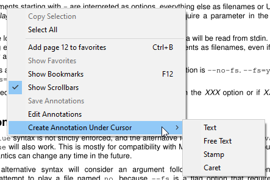

# Editing annotations

**Available in version 3.3 or later.**

You can add and edit annotations in PDF files.

## Highlight text with `a`

The most common annotation is a text highlight: select text and press `a`. This creates a yellow highlight annotation:

Here I highlighted the word `USAGE` and pressed `a`.

## Saving annotations back to PDF file

Notice the **You have unsaved annotations** message in the upper-right corner of the toolbar.

When you close the document (or exit the app) and have unsaved annotations, SumatraPDF will ask if you want to save them:

If you close the dialog or choose `Discard`, annotations will be lost.

`Save changes to existing PDF` will overwrite the PDF with the newly added annotations.

`Save changes to a new PDF` will allow you to save as a new file.

## Edit PDF mode

Turn on **Edit PDF** in the main toolbar to add, select, and change annotations. `Shift + A` creates a highlight (the same as lowercase `a`) and also turns on Edit PDF mode.

**Find Annotation**, near the end of the Edit PDF toolbar (before the save buttons), opens a floating **Annotations** window: a search box (`filter N annotations`) over the list of the document's annotations. Press it again, or close the window, to hide it.

## Other annotations for selected text

When you select text, you can create the following annotations from the selection:

- highlight
- underline
- strike out
- squiggly underline

We also copy the selected text to the clipboard, so you can, for example, use `Ctrl + V` to paste it into the annotation's `Contents` property.

## Other annotation types

You can also create an annotation object at the mouse location:

- text
- free text
- stamp
- caret
- image from the clipboard
- image from a file (`Insert Image...`)

Click a selected shape annotation (including polygon, polyline, and ink) and drag to move it.

To put a picture of your signature (or any other image) on a PDF page:

- **File → Insert Image...**, or
- right-click the page → **Document → Insert Image...**, or
- right-click the page → **Create annotation under cursor → Image From File...**

Pick a PNG (or JPEG, etc.). The image is stamped on the page and you can drag or resize it. Save with **File → Save Annotations to existing PDF** (or save as a new PDF). This is an electronic signature image, not a cryptographic digital signature (`File → Sign Document...`, which uses a certificate from the Windows store or a `.pfx` / `.p12` file). **Sign Document** can also draw a PNG or JPEG inside the digital signature itself, and you can turn off the "Digitally signed by" labels and the other lines.

## Highlighter brush

The **Highlighter** is a marker pen: drag on the page and it paints a wide translucent stroke wherever the mouse goes, over pictures and blank areas as well as text. The selection-based **Highlight** (`a`) still needs text to attach to.

Start it from the **Annotations** toolbar, from the command palette, or with right-click → **Create annotation under cursor → Highlighter**. Drag to paint, release the mouse or pen to finish, `Esc` to cancel. Closing the hint at the bottom of the window also finishes polyline. The stroke keeps a constant on-screen width while you draw, whatever the zoom.

**Ink** is the same on a tablet: release commits that stroke and the tool stays selected so you can draw another. `Esc` or closing the hint leaves the tool.

It is saved as an ink annotation in the `HighlightColor` from Advanced Settings (yellow by default) at 40% opacity, so you can move, recolor, or delete it like any other annotation.

## Changing an annotation

Click an annotation in Edit PDF mode to select it. A compact property row appears under it (color, opacity, border, font, icon, line endings, Contents). A file attachment's row starts with **Attach File**, and **Save Attachment** once a file is embedded. Icon, line-ending, and text-alignment menus show the glyph next to the name. The filter list and floating list also select an annotation when you click a row.

Outside Edit PDF mode, click a file attachment whose file Sumatra can open (a PDF, for example) to open it in a new tab. Use **Save Attachment** on the page context menu to write it to disk.

Delete the selected annotation with `Delete`, or with **Delete Annotation** in the floating list.

`Ctrl + C` copies the selected annotation. `Ctrl + V` pastes a copy with its top-left corner at the mouse. You can paste on another page, or into another PDF. Copy and Paste are also on the page context menu and in the command palette.

`Ctrl + X` cuts: it copies the annotation under the cursor (or the selected one, like `Delete` does) and the original is deleted when you paste, so nothing is lost if the paste doesn't happen. Only the first paste moves the annotation; pasting again makes copies.

Only annotations that can be moved can be copied. Text markup (highlight, underline, squiggly, strike-out) is anchored to the text it covers, so it can't be copied and pasted elsewhere. Neither can file attachments, whose embedded file isn't copied.

## Undo and redo

`Ctrl + Z` takes back the last change to the PDF, `Ctrl + Shift + Z` re-applies it. The Undo and Redo buttons on the Edit PDF toolbar do the same and are greyed out when there is nothing to step to. The two buttons after them save the changes into the file you are reading or into a new PDF, and are greyed out while there is nothing to save.

One gesture is one step: creating an annotation also sets its color, size and contents, and a resize drag rewrites it as the mouse moves, but a single `Ctrl + Z` takes all of it back. The history covers everything that changes the document, not just annotations, and goes back to the state the file was opened (or last saved) in — undoing every change makes the document count as unmodified again.

## Moving annotations

To move an annotation on the page, left-click it and drag it in Edit PDF mode.

## Default colors, size, and opacity

Open **Settings → Advanced Options...** and edit the `Annotations` block:

| Setting                                     | Used for                                       |
| ------------------------------------------- | ---------------------------------------------- |
| `HighlightColor`                            | New highlights (`a`) — default `#ffff00`       |
| `UnderlineColor`                            | Underline annotations                          |
| `SquigglyColor`                             | Squiggly underline                             |
| `StrikeOutColor`                            | Strike-out                                     |
| `FreeTextColor` / `FreeTextBackgroundColor` | Free text annotations                          |
| `FreeTextSize`                              | Default font size for free text (default `12`) |
| `FreeTextBorderWidth`                       | Border width for free text                     |
| `FreeTextOpacity`                           | `0`–`100` percent opacity for free text        |
| `TextIconColor` / `TextIconType`            | Sticky-note style icons                        |
| `DefaultAuthor`                             | Author name written into new annotations       |

Highlight, underline, squiggly and strike-out colors accept `#aarrggbb` so you can set a default opacity: `#80ffff00` is a half-transparent yellow highlight. `#rrggbb` (6 digits) is fully opaque. You can still change one annotation's opacity from the compact property row.

Free-text opacity is the separate `FreeTextOpacity` percent (0–100).

See [Advanced options / settings](Advanced-options-settings.md) for the full list.

### Keyboard shortcuts with custom colors

**Ver 3.6+:** `CmdCreateAnnotHighlight` accepts a color argument. You can bind e.g. green highlights to a key — see [Customize keyboard shortcuts](Customize-keyboard-shortcuts.md).

### Toolbar buttons

Add annotation commands to the toolbar via the `Shortcuts` array — see [Customize toolbar](Customize-toolbar.md). Example commands: `CmdCreateAnnotHighlight`, `CmdCreateAnnotUnderline`, `CmdSaveAnnotations`.

## Saving workflow

| Action                   | Shortcut / command                                                                                                     |
| ------------------------ | ---------------------------------------------------------------------------------------------------------------------- |
| Save annotations to file | `Ctrl + Shift + S` (`CmdSaveAnnotations`), or the save button at the end of the Edit PDF toolbar                       |
| Save to a new PDF        | `CmdSaveAnnotationsNewFile` (tab context menu, command palette, or the last button of the Edit PDF toolbar)            |
| Discard unsaved changes  | `CmdDiscardChanges` (tab context menu **Discard changes**, or `Ctrl + K` command palette) — reloads the file from disk |
| Save when closing        | Prompt dialog — choose existing file, new file, or discard                                                             |

`Ctrl + Z` undoes the last change and `Ctrl + Shift + Z` redoes it (see **Undo and redo** above). Delete an annotation with `Delete` when it is selected, or with **Delete Annotation** in the floating list.

To avoid the save prompt on every close, save explicitly with `Ctrl + Shift + S` before closing. To drop unsaved work without closing the tab, use **Discard Changes** (`CmdDiscardChanges`).

## Annotations from other programs

SumatraPDF can display most standard PDF annotations created in Acrobat, Foxit, etc. Some proprietary annotation types may show only an icon. Free-text presets and appearance vary between editors.

## Missing features

We don't yet support every annotation type or every editing operation other PDF apps offer.

The future will be driven by your feedback. If features are missing or there are better ways of doing things, let us know in [Discussions](https://github.com/sumatrapdfreader/sumatrapdf/discussions).

When providing feedback:

- tell us what
- tell us why. Context is important for prioritizing features. Is the new feature or idea something you absolutely need, or is it just a nice improvement?
- you might be familiar with how other PDF editors work. When referencing feature or UI ideas from other apps, tell us which app you mean. Screenshots are better than words when describing UI ideas.
