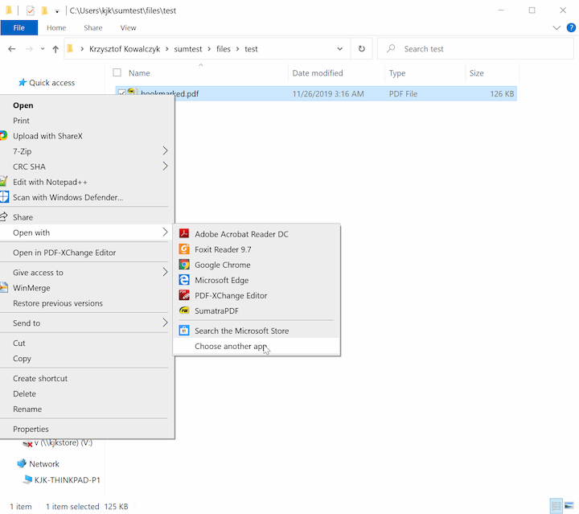
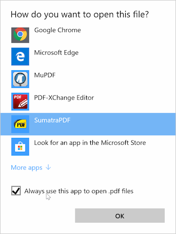
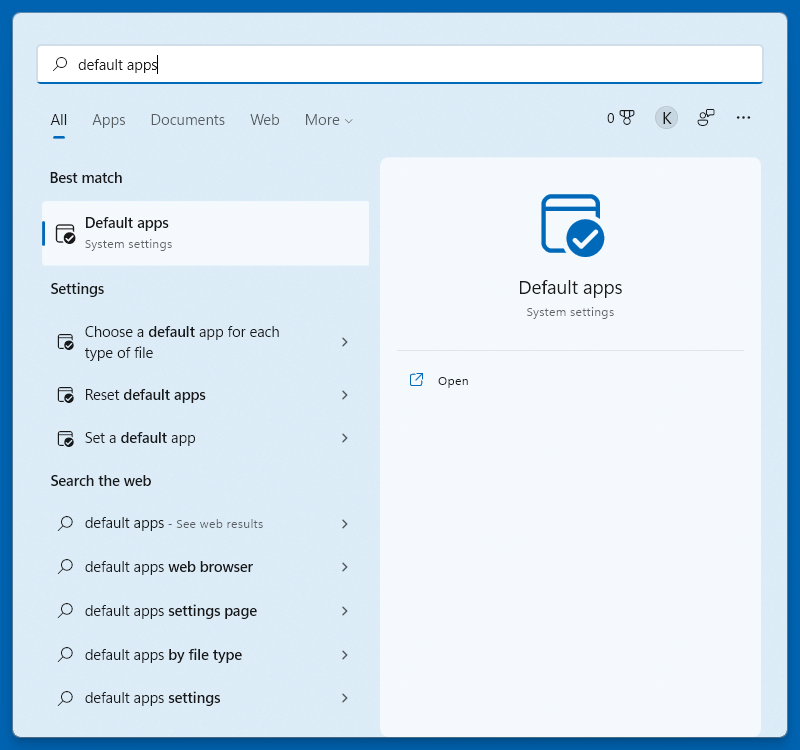
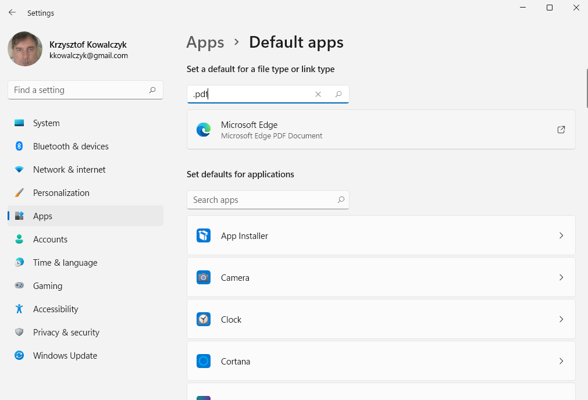

# Set as default PDF viewer

SumatraPDF registers itself for all [supported file types](Supported-document-formats.md) (.pdf, .png etc.).

If there are no other applications registered for a given extension, you can open the file in SumatraPDF simply by double-clicking the file in File Explorer.

If there is more than one application, you have to explicitly tell Windows 10+ to make SumatraPDF default application.

## Using File Explorer

In File Explorer:

- find a .pdf file (or any other supported file type)
- right-click to get a context menu
- select `Open with` and then `Choose another app`

From the list, choose `SumatraPDF` and check `Always use this app to open .pdf files`:

## Using Default apps system settings

This is based on latest Windows 11 build at the time of this writing.

Unfortunately the details differ between Windows updates.

Launch `Default app` section in settings app, e.g. use `Windows logo` hot-key to launch system-wide search, type `default apps` and click on `Default apps` search result to launch settings app.

In Default apps type `.pdf` for file extension:

Click on current default PDF application (`Microsoft Edge` in this example) and select `SumatraPDF`:

You can do that for other file formats.
