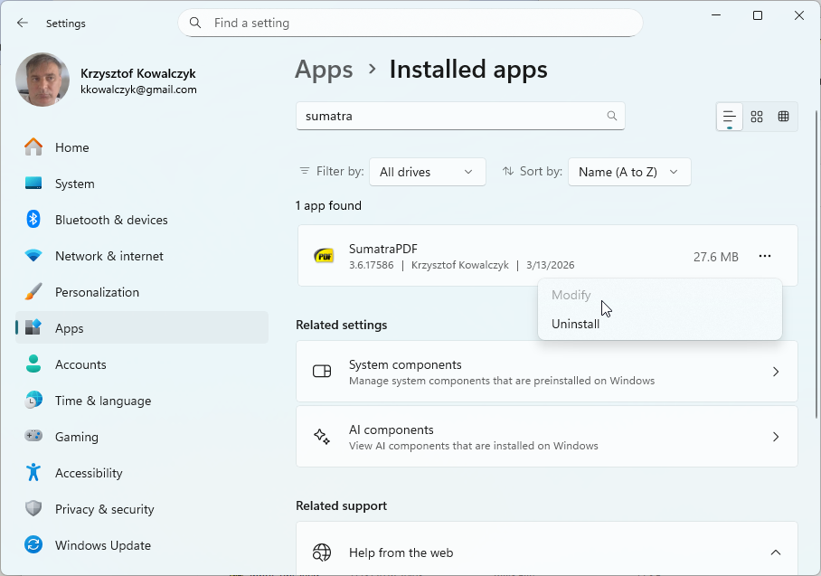

# Uninstalling SumatraPDF

## Are you using official Sumatra build?

Did you download Sumatra from [official Sumatra website](https://www.sumatrapdfreader.org/download-free-pdf-viewer)?

If not, we can't help you because we didn't create the software you're using.

## Uninstalling Sumatra

There are 2 versions of Sumatra: an installer and a portable version (zipped executable).

## Uninstalling portable version

If you're using zipped executable, the only thing you need to do is to delete SumatraPDF.exe.

## Uninstalling the installer version

If you installed SumatraPDF by running official installer, you uninstall it like every other application.

On Windows 10 / 11:

- start Settings app ([https://www.digitalcitizen.life/introducing-windows-10-ways-open-settings](https://www.digitalcitizen.life/introducing-windows-10-ways-open-settings))
- Select `Apps`
- find `SumatraPDF` on the list, click it and press `Uninstall` button:

## What if the above doesn't help?

What if you still have questions? You can use the [forums](https://forum.sumatrapdfreader.org/) to ask for additional help.

However, in order for someone to help you, you need to provide the following information:

- Sumatra PDF version you're using
- your OS (Windows) version
- did you download an installer or zipped executable?
- where did you download the Sumatra from (the url of the webpage you used to download Sumatra)?
- is there SumatraPDF directory in your program files directory (usually "c:\Program Files" or "c:\Program Files (x86)" on 64-bit systems)?
- what evidence there is that Sumatra is installed? Be precise and specific. Don't just say "there's a link to it", tell us where that link is, what is the name of the link etc.

To emphasize: if you don't provide this information, we cannot help you.