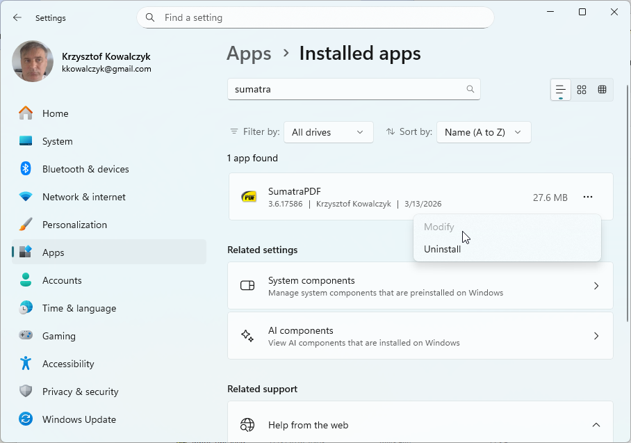

# Uninstalling SumatraPDF

## Are you using an official SumatraPDF build?

Did you download SumatraPDF from the [official SumatraPDF website](https://www.sumatrapdfreader.org/download-free-pdf-viewer)?

If not, we can't help you because we didn't create the software you're using.

## Uninstalling Sumatra

There are two versions of SumatraPDF: an installer and a portable version (zipped executable).

## Uninstalling portable version

If you're using the zipped executable, you only need to delete `SumatraPDF.exe`.

## Uninstalling the installer version

If you installed SumatraPDF by running the official installer, uninstall it like any other application.

On Windows 10 / 11:

- start the Settings app ([instructions](https://www.digitalcitizen.life/introducing-windows-10-ways-open-settings))
- select `Apps`
- find `SumatraPDF` in the list, click it, and press the `Uninstall` button:

## What if the above doesn't help?

What if you still have questions? You can use [Discussions](https://github.com/sumatrapdfreader/sumatrapdf/discussions) to ask for additional help.

However, in order for someone to help you, you need to provide the following information:

- Sumatra PDF version you're using
- your OS (Windows) version
- did you download an installer or a zipped executable?
- where did you download SumatraPDF from (the URL of the webpage you used)?
- is there a SumatraPDF directory in your Program Files directory (usually `C:\Program Files` or `C:\Program Files (x86)` on 64-bit systems)?
- what evidence is there that SumatraPDF is installed? Be precise and specific. Don't just say "there's a link to it"; tell us where that link is, what its name is, etc.

To emphasize: if you don't provide this information, we cannot help you.
