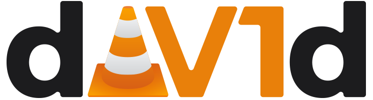

# dav1d

**dav1d** is an **AV1** cross-platform **d**ecoder, open-source, and focused on speed and correctness.

It is now battle-tested and production-ready and can be used everywhere.

The canonical repository URL for this repo is https://code.videolan.org/videolan/dav1d

This project was partially funded by the *Alliance for Open Media*/**AOM**.

## Goal and Features

The goal of this project is to provide a decoder for **most platforms**, and achieve the **highest speed** possible to overcome the temporary lack of AV1 hardware decoder.

It supports all features from AV1, including all subsampling and bit-depth parameters.

In the future, this project will host simple tools or simple wrappings *(like, for example, an MFT transform)*.

## License

**dav1d** is released under a very liberal license, a contrario from the other VideoLAN projects, so that it can be embedded anywhere, including non-open-source software; or even drivers, to allow the creation of hybrid decoders.

The reasoning behind this decision is the same as for libvorbis, see [RMS on vorbis](https://lwn.net/2001/0301/a/rms-ov-license.php3).

# Roadmap

The plan is the following:

### Reached
1. Complete C implementation of the decoder,
2. Provide a usable API,
3. Port to most platforms,
4. Make it fast on desktop, by writing asm for AVX2 chips.
5. Make it fast on mobile, by writing asm for ARMv8 chips,
6. Make it fast on older desktop, by writing asm for SSSE3+ chips,
7. Make high bit-depth fast on mobile, by writing asm for ARMv8 chips.
8. Make it fast on older mobile, by writing asm for ARMv7 chips,
9. Make high bit-depth fast on older mobile, by writing asm for ARMv7 chips,
10. Make high bit-depth fast on desktop, by writing asm for AVX2 chips,
11. Make high bit-depth fast on older desktop, by writing asm for SSSE3+ chips,
12. Improve threading.

### On-going
13. Improve C code base with [various tweaks](https://code.videolan.org/videolan/dav1d/wikis/task-list),
14. Accelerate for less common architectures, like PPC, SSE2, RISC-V or AVX-512.

### After
15. Use more GPU decoding, when possible.

# Contribute

Currently, we are looking for help from:
- C developers,
- asm developers,
- platform-specific developers,
- GPGPU developers,
- testers.

Our contributions guidelines are quite strict. We want to build a coherent codebase to simplify maintenance and achieve the highest possible speed.

Notably, the codebase is in pure C and asm.

We are on IRC, on the **#dav1d** channel on [*Libera.chat*](http://libera.chat/). If you do not have an IRC Client at hand, use [IRC Web Interface](https://web.libera.chat/#dav1d).

See the [contributions document](CONTRIBUTING.md).

## CLA

There is no CLA.

People will keep their copyright and their authorship rights, while adhering to the BSD 2-clause license.

VideoLAN will only have the collective work rights.

## CoC

The [VideoLAN Code of Conduct](https://wiki.videolan.org/CoC) applies to this project.

# Compile

1. Install [Meson](https://mesonbuild.com/) (0.49 or higher), [Ninja](https://ninja-build.org/), and, for x86\* targets, [nasm](https://nasm.us/) (2.14 or higher)
2. Run `mkdir build && cd build` to create a build directory and enter it
3. Run `meson ..` to configure meson, add `--default-library=static` if static linking is desired
4. Run `ninja` to compile

## Cross-Compilation for 32- or 64-bit Windows, 32-bit Linux

If you're on a linux build machine trying to compile .exe for a Windows target/host machine, run

```
meson build --cross-file=package/crossfiles/x86_64-w64-mingw32.meson
```

or, for 32-bit:

```
meson build --cross-file=package/crossfiles/i686-w64-mingw32.meson
```

`mingw-w64` is a pre-requisite and should be installed on your linux machine via your preferred method or package manager. Note the binary name formats may differ between distributions. Verify the names, and use `alias` if certain binaries cannot be found.

For 32-bit linux, run

```
meson build --cross-file=package/crossfiles/i686-linux32.meson
```

## Build documentation

1. Install [doxygen](https://www.doxygen.nl/) and [graphviz](https://www.graphviz.org/)
2. Run `meson build -Denable_docs=true` to create the build directory
3. Run `ninja -C build doc/html` to build the docs

The result can be found in `build/doc/html/`. An online version built from master can be found [here](https://videolan.videolan.me/dav1d/).

# Run tests

1. In the root directory, run `git clone https://code.videolan.org/videolan/dav1d-test-data.git tests/dav1d-test-data` to fetch the test data repository
2. During meson configuration, specify `-Dtestdata_tests=true`
3. Run `meson test -v` after compiling

# Support

This project is partially funded by the *Alliance for Open Media*/**AOM** and is supported by TwoOrioles and VideoLabs.

These companies can provide support and integration help, should you need it.


# FAQ

## Why do you not improve libaom rather than starting a new project?

- We believe that libaom is a very good library. It was however developed for research purposes during AV1 design.
We think that an implementation written from scratch can achieve faster decoding, in the same way that *ffvp9* was faster than *libvpx*.

## Is dav1d a recursive acronym?

- Yes.

## Can I help?

- Yes. See the [contributions document](CONTRIBUTING.md).

## I am not a developer. Can I help?

- Yes. We need testers, bug reporters and documentation writers.

## What about the AV1 patent license?

- This project is an implementation of a decoder. It gives you no special rights on the AV1 patents.

Please read the [AV1 patent license](doc/PATENTS) that applies to the AV1 specification and codec.

## Will you care about <my_arch>? <my_os>?

- We do, but we don't have either the time or the knowledge. Therefore, patches and contributions welcome.
