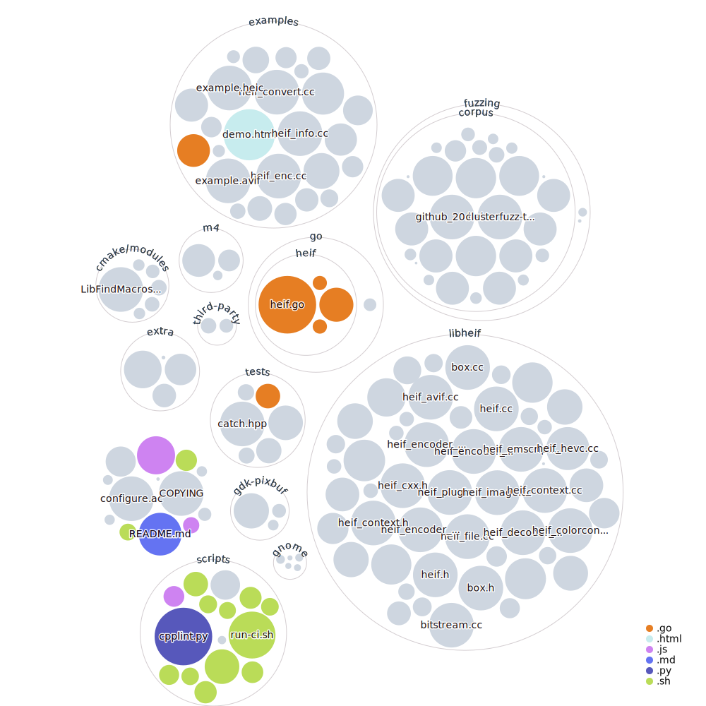

# libheif

[](https://github.com/strukturag/libheif/actions) [](https://ci.appveyor.com/project/strukturag/libheif) [](https://scan.coverity.com/projects/strukturag-libheif)


libheif is an ISO/IEC 23008-12:2017 HEIF and AVIF (AV1 Image File Format) file format decoder and encoder.

HEIF and AVIF are new image file formats employing HEVC (h.265) or AV1 image coding, respectively, for the
best compression ratios currently possible.

libheif makes use of [libde265](https://github.com/strukturag/libde265) for HEIF image decoding and x265 for encoding.
For AVIF, libaom, dav1d, or rav1e are used as codecs.


## Supported features

libheif has support for decoding
* tiled images
* alpha channels
* thumbnails
* reading EXIF and XMP metadata
* reading the depth channel
* multiple images in a file
* image transformations (crop, mirror, rotate)
* overlay images
* plugin interface to add alternative codecs for additional formats (AVC, JPEG)
* decoding of files while downloading (e.g. extract image size before file has been completely downloaded)
* reading color profiles
* heix images (10 and 12 bit, chroma 4:2:2)

The encoder supports:
* lossy compression with adjustable quality
* lossless compression
* alpha channels
* thumbnails
* save multiple images to a file
* save EXIF and XMP metadata
* writing color profiles
* 10 and 12 bit images
* monochrome images

## API

The library has a C API for easy integration and wide language support.
Note that the API is still work in progress and may still change.

The decoder automatically supports both HEIF and AVIF through the same API. No changes are required to existing code to support AVIF.
The encoder can be switched between HEIF and AVIF simply by setting `heif_compression_HEVC` or `heif_compression_AV1`
to `heif_context_get_encoder_for_format()`.

Loading the primary image in an HEIF file is as easy as this:

```C
heif_context* ctx = heif_context_alloc();
heif_context_read_from_file(ctx, input_filename, nullptr);

// get a handle to the primary image
heif_image_handle* handle;
heif_context_get_primary_image_handle(ctx, &handle);

// decode the image and convert colorspace to RGB, saved as 24bit interleaved
heif_image* img;
heif_decode_image(handle, &img, heif_colorspace_RGB, heif_chroma_interleaved_RGB, nullptr);

int stride;
const uint8_t* data = heif_image_get_plane_readonly(img, heif_channel_interleaved, &stride);
```

Writing an HEIF file can be done like this:

```C
heif_context* ctx = heif_context_alloc();

// get the default encoder
heif_encoder* encoder;
heif_context_get_encoder_for_format(ctx, heif_compression_HEVC, &encoder);

// set the encoder parameters
heif_encoder_set_lossy_quality(encoder, 50);

// encode the image
heif_image* image; // code to fill in the image omitted in this example
heif_context_encode_image(ctx, image, encoder, nullptr, nullptr);

heif_encoder_release(encoder);

heif_context_write_to_file(context, "output.heic");
```

See the header file `heif.h` for the complete C API.

There is also a C++ API which is a header-only wrapper to the C API.
Hence, you can use the C++ API and still be binary compatible.
Code using the C++ API is much less verbose than using the C API directly.

There is also an experimental Go API, but this is not stable yet.


## Compiling

This library uses either a standard autoconf/automake build system or CMake.

When using autoconf, run `./autogen.sh` to build the configuration scripts,
then call `./configure` and `make`.
Make sure that you compile and install [libde265](https://github.com/strukturag/libde265)
first, so that the configuration script will find this.
Preferably, download the `frame-parallel` branch of libde265, as this uses a
more recent API than the version in the `master` branch.
Also install x265 and its development files if you want to use HEIF encoding.

For AVIF support, make sure that libaom is installed.

### macOS

1. Install dependencies with Homebrew

    ```
    brew install automake make pkg-config x265 libde265 libjpeg
    ```


1. Configure and build project

    ```
    ./autogen.sh
    ./configure
    make
    ```

### Windows

Libheif is included in [Vcpkg](https://github.com/Microsoft/vcpkg/).


### Adding rav1e encoder for AVIF

* Install `cargo`.
* Install `cargo-c` by executing
```
cargo install --force cargo-c
```
* Run the `rav1e.cmd` script in directory `third-party` to download rav1e and compile it.

When running `cmake` or `configure`, make sure that the environment variable
`PKG_CONFIG_PATH` includes the absolute path to `third-party/rav1e/dist/lib/pkgconfig`.


### Adding dav1d decoder for AVIF

* Install [`meson`](https://mesonbuild.com/).
* Run the `dav1d.cmd` script in directory `third-party` to download dav1d and compile it.

When running `cmake` or `configure`, make sure that the environment variable
`PKG_CONFIG_PATH` includes the absolute path to `third-party/dav1d/dist/lib/x86_64-linux-gnu/pkgconfig`.


## Language bindings

* .NET Platform (C#, F#, and other languages): [libheif-sharp](https://github.com/0xC0000054/libheif-sharp)
* C++: part of libheif
* Go: part of libheif
* JavaScript: by compilation with emscripten (see below)
* NodeJS module: [libheif-js](https://www.npmjs.com/package/libheif-js)
* Python: [pyheif](https://pypi.org/project/pyheif/), [pillow_heif](https://pypi.org/project/pillow-heif/)
* Rust: [libheif-sys](https://github.com/Cykooz/libheif-sys)
* Swift: [libheif-Xcode](https://swiftpackageregistry.com/SDWebImage/libheif-Xcode)

Languages that can directly interface with C libraries (e.g., Swift, C#) should work out of the box.


## Compiling to JavaScript

libheif can also be compiled to JavaScript using
[emscripten](http://kripken.github.io/emscripten-site/).
See the `build-emscripten.sh` for further information.


## Online demo

Check out this [online demo](https://strukturag.github.io/libheif/).
This is `libheif` running in JavaScript in your browser.


## Example programs

Some example programs are provided in the `examples` directory.
The program `heif-convert` converts all images stored in an HEIF/AVIF file to JPEG or PNG.
`heif-enc` lets you convert JPEG files to HEIF/AVIF.
The program `heif-info` is a simple, minimal decoder that dumps the file structure to the console.

For example convert `example.heic` to JPEGs and one of the JPEGs back to HEIF:

```
cd examples/
./heif-convert example.heic example.jpeg
./heif-enc example-1.jpeg -o example.heif
```

In order to convert `example-1.jpeg` to AVIF use:
```
./heif-enc example-1.jpeg -A -o example.avif
```

There is also a GIMP plugin using libheif [here](https://github.com/strukturag/heif-gimp-plugin).


## HEIF/AVIF thumbnails for the Gnome desktop

The program `heif-thumbnailer` can be used as an HEIF/AVIF thumbnailer for the Gnome desktop.
The matching Gnome configuration files are in the `gnome` directory.
Place the files `heif.xml` and `avif.xml` into `/usr/share/mime/packages` and `heif.thumbnailer` into `/usr/share/thumbnailers`.
You may have to run `update-mime-database /usr/share/mime` to update the list of known MIME types.


## gdk-pixbuf loader

libheif also includes a gdk-pixbuf loader for HEIF/AVIF images. 'make install' will copy the plugin
into the system directories. However, you will still have to run `gdk-pixbuf-query-loaders --update-cache`
to update the gdk-pixbuf loader database.


## Software using libheif

* GIMP
* Krita
* ImageMagick
* digiKam 7.0.0
* libvips
* [Kodi HEIF image decoder plugin](https://kodi.wiki/view/Add-on:HEIF_image_decoder)
* [bimg](https://github.com/h2non/bimg)
* [GDAL](https://gdal.org/drivers/raster/heif.html)
* [OpenImageIO](https://sites.google.com/site/openimageio/)

## Source code visualization



[Explore source](https://octo-repo-visualization.vercel.app/?repo=strukturag%2Flibheif)

## License

The libheif is distributed under the terms of the GNU Lesser General Public License.
The sample applications are distributed under the terms of the MIT License.

See COPYING for more details.

Copyright (c) 2017-2020 Struktur AG
Contact: Dirk Farin <dirk.farin@gmail.com>
